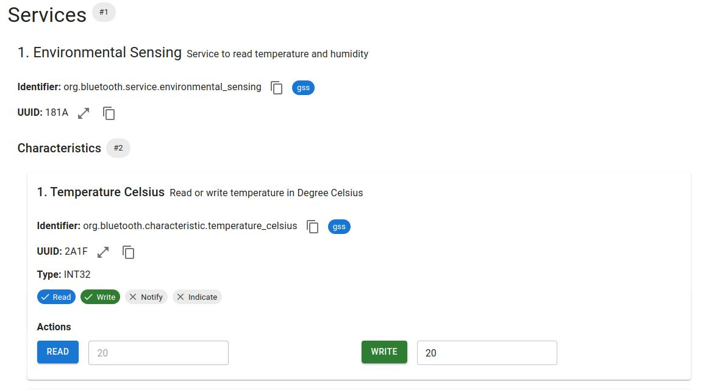

# OpenBLE

OpenBLE is swagger for Bluetooth Low Energy (BLE), an API definition language for GATT services.

## Demo

https://demo.openble.org

## Links

- [Demo video](https://youtube.com)
- [Follow on GitHub](https://github.com/openble-org/openble-sdk)
- Email: shardul@openble.org

## Features

1. Define your GATT services in YAML.
2. Say goodbye to searching UUIDs in datasheets. Directly use GATT and Nordic identifiers.
3. Read and write from your browser with Web Bluetooth.
4. Automatically validate your schema against a connected device.
5. Generate type safe clients and peripherals using a platform agnostic specification.

## What OpenBLE can do

- Enforce data types
- Validate attributes of a peripheral server

## What OpenBLE cannot do

- Validate your attributes against GATT profile requirements. It is the developer's job to ensure use of correct datatypes, value range.
- Support non-GATT profiles such as audio.

## Motivation

Bluetooth development is frustrating. While building an environment sensor on Arduino, I had to

- Look up specifications in [PDF sheets](https://files.seeedstudio.com/wiki/SeeedStudio-XIAO-ESP32S3/res/GATT.pdf)
- Write services / clients by hand for each platform I wanted to support. Building my climate sensor app involved
  1. Writing the arduino perepheral in C++
  2. Writing clients and encoders/decoders by hand. Every platform I wished to support had its own language and libraries. Mobile cross platform SDKs in React Native and Flutter do not support desktop, and the desktop implementations don't support mobile. Under the hood every OS (linux, macOS, windows, phones) have their own bluetooth implementation.
- Dealing with library sprawl. Android has an official SDK from Google and additionally two more from Nordic. Then the canonical BLE library for NodeJS is abandoned; a community fork is being used.

I scratched my head, realizing that

- A Swagger / OpenAPI style specification would make development 10x faster
- Web bluetooth supports all platforms except iOS and works out of the box, straight from the browser

The OpenBLE spec benefits from but does not depend on web bluetooth.

