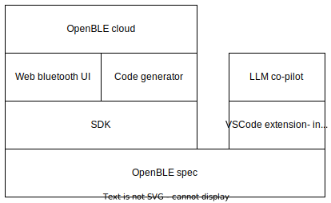

# Roadmap

- Finalize the specification
- Support all major platforms and clients
- VSCode extension for validating schema
- OpenBLE cloud: Postman for teams building bluetooth apps
- LLM co-pilot to help implement GATT specs

## Work in progress

- [ ] Support descriptors
- [ ] Notifications
- [ ] More clients- currently just Arduino is supported.
- [ ] Additional datatypes
